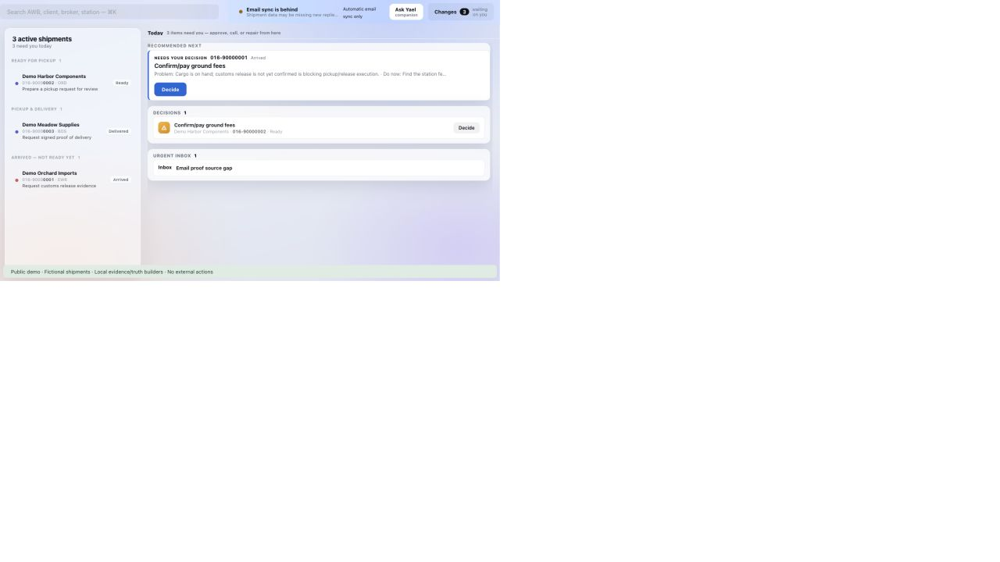

# PQ Ops

An import-operations control room that combines shipment inventory, email evidence, attachments, tracking, and operator updates into current shipment state and the next action.

**Public edition:** application structure, database migrations, integrations, and security controls retained; operational data replaced or excluded. [Data boundary](docs/PUBLIC_DATA.md).



## Run the actual interface with fictional shipments

```sh
npm ci --ignore-scripts
npm run demo
```

Open **http://127.0.0.1:4173**. The existing interface displays three independently invented shipments: release missing, pickup planning, and delivery reported without signed proof.

The demo invokes the actual evidence and truth-packet builders. Its small local server substitutes for live services, keeps draft actions in memory, and refuses external writes. The companion response is a deterministic synthetic briefing, not a live AI result. The demo intentionally has no active Gmail or TMS connection.

## Architecture

| Layer | Source |
| --- | --- |
| Operator interface | [app.js](app.js), [styles.css](styles.css), [index.html](index.html) |
| Local service and synchronization | [server.js](server.js), [ops-sync.js](ops-sync.js) |
| API routes | [api/](api/) |
| Gmail ingestion | [lib/gmail-direct-ingest.js](lib/gmail-direct-ingest.js), [OAuth routes](api/gmail/oauth/) |
| Evidence and state | [fact ledger](lib/ops-fact-ledger.js), [truth packets](lib/operator-truth-packet.js), [source eligibility](lib/source-fact-contract.js) |
| Companion | [lib/ops-brain-companion.js](lib/ops-brain-companion.js) |
| Action controls | [lib/action-safety.js](lib/action-safety.js), [lib/operator-agency.js](lib/operator-agency.js) |
| Database | [supabase/migrations](supabase/migrations) |
| Synthetic fixtures | [demo/scenarios.js](demo/scenarios.js) |

A source gap remains unknown. A promise of proof of delivery must not become received proof. Generated summaries and prior projections must not become new source evidence.

## Verify

```sh
npm run test:public
npm run build
```

The synthetic regression exercises the actual source-evidence and truth builders and distinguishes promised proof from received proof. Historic operational replay datasets are not bundled.

## Full integrations

`npm start` runs the original application server. Configure your own services using `.env.example`; it contains names only. Database migrations and service adapters are preserved for inspection and independent setup. Never point the public demo at an operational company database or mailbox.
