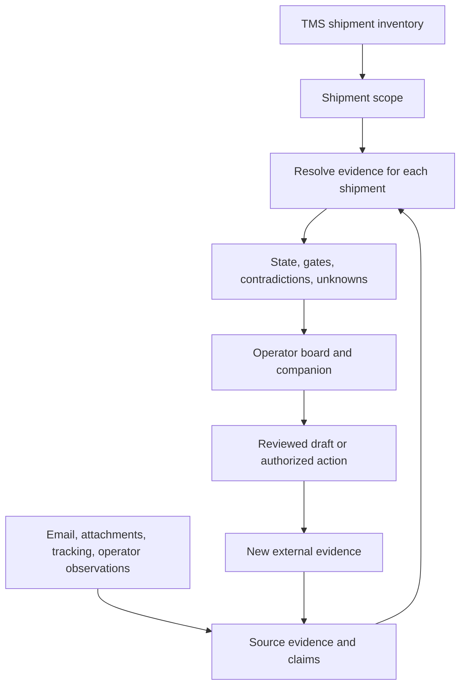

# Engineering guide: PQ Ops

[Overview](../README.md) · [Run and inspect](REVIEW.md) · [Public data boundary](PUBLIC_DATA.md)

## The problem and the design

An import desk receives overlapping accounts of the same shipment: inventory in a TMS, airline tracking, station emails, attachments, and operator updates. These sources can be late, incomplete, or contradictory. The useful output is a defensible current state and the next action the operator can actually take.

PQ Ops treats source evidence, interpreted claims, current state, and proposed actions as different objects. That distinction prevents a generated summary from becoming its own proof during the next refresh. It also makes uncertainty visible: a missing POD in the system does not imply the freight was never delivered.

The final edge represents new evidence from the outside world. A previous board state or generated answer is not that evidence.

## Two paths worth distinguishing

The repository retains both the operator packet layer and a deeper relational truth pipeline. The keyless demo executes the **operator packet layer** over independent synthetic records. It does not run the full live ingestion, model extraction, relational publication, or refresh infrastructure.

| Layer | Source | Responsibility |
| --- | --- | --- |
| Intake and synchronization | [Gmail ingest](../lib/gmail-direct-ingest.js), [synchronization](../ops-sync.js) | Acquire and associate source material with the shipment inventory. |
| Source eligibility | [Source contract](../lib/source-fact-contract.js) | Reject canonical conclusions, prior packets, UI projections, and action-planner output as fresh source facts, even if they carry copied message IDs. |
| Operational facts | [Fact ledger](../lib/ops-fact-ledger.js) | Interpret operational statements with distinctions such as promised versus received proof. |
| Operator packets | [Packet builder](../lib/operator-truth-packet.js) | Assemble cited source facts, milestone gates, physical lifecycle, operational blockers, fee reconciliation, contradictions, freshness, and next action. |
| Relational reduction | [Reducer](../lib/relational-truth-reducer.js), [precedence policy](../lib/truth-precedence-policy.js), [policy artifact](../config/truth-precedence-policy-v1.json) | Reduce versioned evidence and claims using explicit ordering and provenance. |
| Consistent inputs | [Source-cut ledger](../lib/truth-source-cut-ledger.js), [temporal resolver](../lib/truth-temporal-resolver.js) | Identify a bounded set of source inputs and interpret event timing. A “source cut” is a recorded boundary around the inputs used for a reduction. |
| Human work | [Operator agency](../lib/operator-agency.js), [action safety](../lib/action-safety.js) | Distinguish actionable work from waiting or monitoring; separate proposed content from authorized execution. |
| Presentation | [Interface](../app.js), [companion](../lib/ops-brain-companion.js) | Present the current picture and support operator decisions. |

## Decisions and their costs

### Evidence cannot be manufactured by re-reading a conclusion

The source contract rejects rows explicitly produced by a reducer, truth packet, UI projection, or action planner. Copying a Gmail message pointer into such a row does not make it eligible again. The underlying source claim must be retained separately.

This prevents circular corroboration. It increases the need for provenance bookkeeping: downstream code must retain source coordinates and distinguish observations from computed state. A source pointer helps inspection; it does not independently prove that a model interpreted the source correctly.

### Physical progress and paperwork are separate

The packet includes both a physical lifecycle and operational/document blockers. Cargo can have arrived while customs evidence is missing. Delivery can be confirmed while signed proof remains outstanding. Ground-fee claims and payments have their own reconciliation.

This produces a more complicated state model than a single “status” field. The benefit is that a missing document need not rewrite physical history, and completed physical movement need not erase unfinished work. The public regression specifically checks that delivered-without-POD remains operator work.

### Time and source authority are explicit

The relational pipeline separates event timing from capture/recording time and uses a versioned precedence policy. This matters when an old message is ingested after a newer operational event: retrieval order alone is a poor definition of truth.

The tradeoff is policy complexity. Resolving a contradiction is a software decision that should be inspectable and reproducible. Retaining this machinery in the source is not evidence that every operational conflict is resolved correctly; broad replay accuracy is outside the public fixture suite.

### The work board represents agency

“Something is uncertain” does not always mean the import operator has something useful to do. The agency classifier distinguishes work that can move now, waiting on an external party, matters outside import scope, monitoring, and decisions requiring a human.

The public edition corrects a closeout edge case: a delivered state with no signed POD must not disappear into monitoring. [The synthetic regression](../demo/verify.js) checks both the packet and the row-level classifier.

### Actions are downstream of evidence and authority

The normal [action contracts](../lib/action-safety.js) distinguish Gmail draft preparation, internal actions, and operator-approved TMS actions. Each channel has its own execution semantics. A generated suggestion is not authorization to send or change a shipment.

The public [demo server](../demo/server.js) only implements in-memory draft responses and refuses other writes. It does not exercise the live action queue or establish that a real TMS action completed.

## The three public cases

| Case | Fictional evidence present | Deliberate gap |
| --- | --- | --- |
| Release needed | Arrival and paid station fees | Customs release remains unknown. |
| Pickup planning | Arrival, customs release, and paid station fees | Pickup has not happened. |
| Delivery reported | Arrival, release, fees, dispatch, pickup, and delivery report | Signed POD has not arrived; closeout remains work. |

[Fixtures](../demo/scenarios.js) provide consistent input records; the actual packet builder derives the display packet. This small set makes the core distinctions easy to inspect. It is not a substitute for the private historical replay corpus.

## Scope of the public evidence

The repo includes the application, API routes, service adapters, [database migrations](../supabase/migrations), policy artifacts, and retained verification code. Only the documented public commands are the reproducible keyless review path. Historical operational scripts may require separately configured services or datasets intentionally excluded from this edition.

The demo's companion response is a deterministic briefing. There is no public claim here about extraction accuracy, autonomous-operation success, refresh throughput, or measured customer impact. The [review protocol](REVIEW.md) states what is tested.
